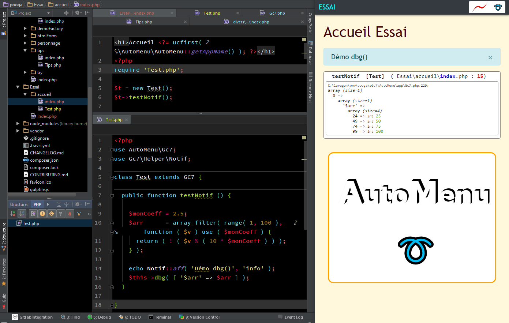

# AutoMenu (AM)

Script à vocation pédagogique uniquement.
Facilite la création de nouvelles page pour tests divers isolés.

Nécessite **PHP 7.1+** et X-debug installé (Recommandé)

## Capture d'écran




## Guide d'installation rapide

1. ***Fork*** le projet 
  
      *(Cf. en haut à droite dans la page d'accueil du projet sur Github)*
2. Clôner VOTRE copie du projet

```ini
[en mode console, dans le dossier de votre virtual localhost : ]
git clone URL_de_votre_dépôt_GitHub_de_VH
```

3. Installer les dépendances

```ini
composer update
```

4. Réaliser toutes modifications, corrections, améliorations, etc... souhaitées

5. Demander une fusion (= Effectuer un ***Merge Request***)

NB: Outils conseillés: **[ungit](https://github.com/FredrikNoren/ungit)** (Intégré facilement dans les éditeurs Brackets ou Visual Studio Code grâce à leurs plugins respectifs) et **[GitKraken](https://www.gitkraken.com/)**

Penser à y ajouter ce dépôt, **AutoMenu** pour synchroniser facilement votre dépôt (Ex. dans Ungit: ***Add Remote*** et l'URL de ce dépôt)

5. [Aide ou Signaler un Bug](https://github.com/c57fr/pooga/issues/new)

## Pour AutoMenu

### IMPORTANT :

### Toujours conserver le dossier ./aGc7/ et les fichiers à la racine

**Pour aisément** et **rapidement naviguer** dans **vos scripts** pour tests

Pour créer votre propre dossier dont le menu sera automatique, visiter l'admin (Lien en haut à droite)

Ensuite, simplement créer un dossier avec le nom de votre choix dans celui-ci et y placer un fichier 'index.php'blog

Ce dossier apparaîtra automatiquement comme point de menu de votre nouveau service


Pour supprimer un de vos dossiers, simplement le supprimer 'en vrai', avec votre gestionnaire de dossiers habituel.


  Pour lancer le serveur

```ini
[Dans le dossier AM]
Gulp
```

## Contenu:

- Un dossier exemple 'Divers'
- Un index exemple

## App pour dev en local exclusivement
En local, recommandé de faire virtual host : [AM](http://AM)
